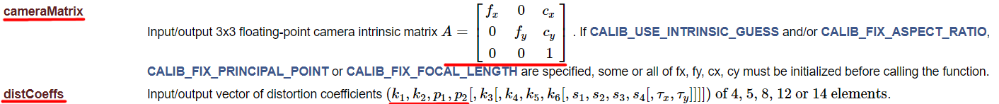
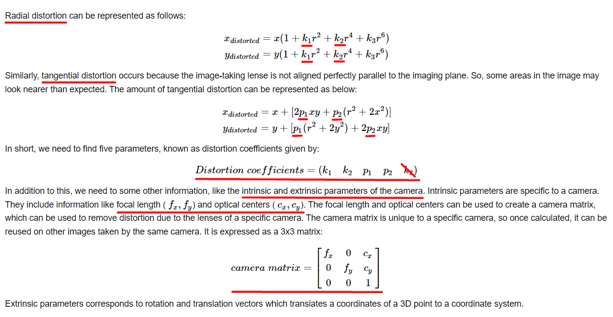
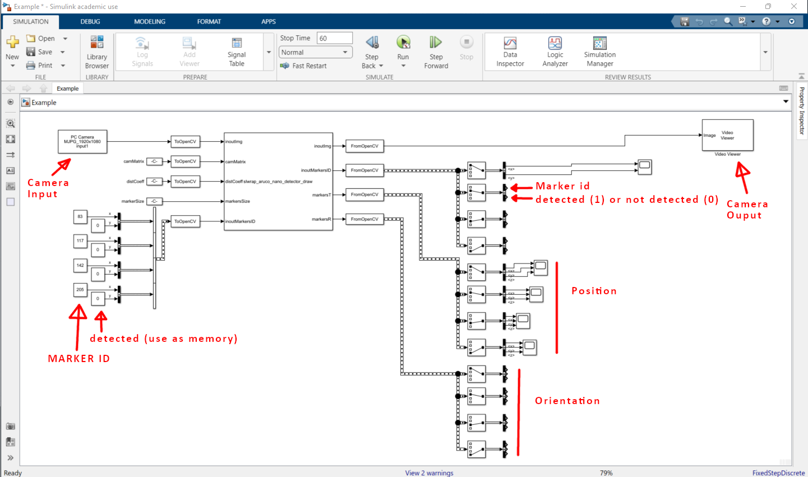

# Objetivo: 
Queremos usar el Computer Vision Toolbox OpenCV Interface for Simulink para detectar la posición del robot usando los tags de Aruco, especificamente usando la librería de Aruco Nano por su fácil uso e implementación. Veáse el video sobre Aruco Nano 4 Release de Rafael Muñoz Salinas - https://www.youtube.com/watch?v=U3sfuy88phA

# Citas:
1."Speeded up detection of squared fiducial markers", Francisco J.Romero-Ramirez, Rafael Muñoz-Salinas, Rafael Medina-Carnicer, Image and Vision Computing, vol 76, pages 38-47, year 2018
2."Generation of fiducial marker dictionaries using mixed integer linear programming",S. Garrido-Jurado, R. Muñoz Salinas, F.J. Madrid-Cuevas, R. Medina-Carnicer, Pattern Recognition:51, 481-491,2016

## Enlace:
- Aruco repository: https://sourceforge.net/projects/aruco/files/

# Pasos a seguir:
## Calibrar la cámara
Para usar esta ejemplo, debemos primero calibrar la cámara, para ello, usaremos la aplicación de calibración dada por Matlab. Es recomendable exportar el script de calibración y guardar la sesión de calibración para recalibrar si fuera necesario.
    
- https://www.mathworks.com/help/vision/ug/using-the-single-camera-calibrator-app.html
- https://www.mathworks.com/help/vision/ug/calibration-patterns.html

IMPORTANTE: En las cámaras con AUTOFOCUS es recomendable poner el modo manual y anotar el valor. Además de la resolución de las imagenes.
- FOCUS: 400
- RESOLUTION: 1920 x 1080 px
- PATTERN SQUARE SIZE: 23.25 mm
- MAX REPROJECTION ERROR: 0.17 (error in pixels)
- MEAN REPROJECTION ERROR: 0.098 (error in pixels)

## OpenCV calibration matrix format
Como OpenCV utiliza una formato de entrada determinada para la calibración de la cámara nos tendremos que ajustar a este para su uso más tarde en Simulink.

<p align="center">

</p>

<p align="center">

</p>

Extraemos estos los parámetros de la variable cameraParams, variable obtenida de la calibración realizada por Matlab.

```Matlab
cameraParams.Intrinsics.FocalLength             % fx, fy
cameraParams.Intrinsics.PrincipalPoint          % cx, cy
cameraParams.Intrinsics.RadialDistortion        % k1, k2
cameraParams.Intrinsics.TangentialDistortion    % p1, p2

camMatrix = [
    cameraParams.Intrinsics.FocalLength(1) 0 cameraParams.Intrinsics.PrincipalPoint(1);
    0 cameraParams.Intrinsics.FocalLength(2) cameraParams.Intrinsics.PrincipalPoint(2);
    0 0 1
];

distCoeff = [cameraParams.Intrinsics.RadialDistortion cameraParams.Intrinsics.TangentialDistortion];

save("camMatrix","camMatrix")
save("distCoeff","distCoeff")
```

Con estos parámetros componemos ya disponemos de las matrices necesarias.

En el script Calibration.m se puede modificar el número de parámetros a obtener de la distorsión radial o con el cameraCalibrator app tiene más opciones de calibración para la cámara.

Si tienes alguna duda, lease el siguiente enlace: https://docs.opencv.org/4.x/dc/dbb/tutorial_py_calibration.html y https://docs.opencv.org/4.x/d9/d0c/group__calib3d.html#ga3207604e4b1a1758aa66acb6ed5aa65d


## Requisitos para usar la cámara con Simulink
- Cámara compatible con UVC (USB Video device Class - "describes devices capable of streaming video" over USB) o ver compatibilidad con https://www.mathworks.com/help/imaq/image-acquisition-support-packages-for-hardware-adaptors.html.
- Instalar el Image Acquisition Toolbox (https://www.mathworks.com/help/releases/R2022a/imaq/index.html?s_tid=CRUX_lftnav)
- Instalar el Image Acquisition Toolbox Support Package for OS Generic Video Interface (https://www.mathworks.com/matlabcentral/fileexchange/45183-image-acquisition-toolbox-support-package-for-os-generic-video-interface). También soporta otro tipo de cámaras, veáse https://www.mathworks.com/help/imaq/image-acquisition-support-packages-for-hardware-adaptors.html.
- Usar la app Image Acquisition Explorer (imageAcquisitionExplorer) (https://www.mathworks.com/help/releases/R2022a/imaq/imageacquisitionexplorer-app.html) para ver si detecta la cámara. Es necesario reiniciar el PC cuando se ha realizado la instalación para su correcto funcionamiento.

## Instalar y usar OpenCV Interface para Simulink
- OpenCV Interface para Simulink (https://www.mathworks.com/help/vision/opencv-interface-support-for-simulink.html)
- Recuerda hacer el setup del compilador de C++. (Set Up Your C++ Compiler) veáse el ejemplo (https://www.mathworks.com/help/vision/ug/smile-detection-opencv.html). Para windows, lo más sencillo es instalar visual studio community o superior, en este caso uso visual studio community 2022.

Tan fácil como ejecutar el comando
```
mex -setup c++
```

## Por último, usar el ejemplo:

- Imprimir del diccionario unos tags con el mismo tamaño, dejo pdf Tags_83_117_142_205.pdf preparado para impresión.
- Cargar el script - "load_params.m"
- Abrir el ejemplo de Simulink - "Example.slx" y realizar los cambios necesarios como la entrada de la cámara y sobretodo, los bloques FromOpenCV que tengan los valores correctos de tamaño de imagen, el tamaño del vector con el número de tags, etc.

<p align="center">

</p>

## Posibles optimizaciones y dudas
- ¿Tengo dudas si una vez compilada la librería es necesario algunos archivos?
- Utilizar al opción de paralelizar el bucle for proporcionada por OpenCV si fuera necesario
- ¿Se podría accelerar la ejecución usando la tarjeta gráfica? Quizás si... no esta explorado. https://www.mathworks.com/help/gpucoder/ug/simulation-acceleration-using-gpu-coder.html

## ¿Como se desarrolla un módulo?

- Como importar código de OpenCV a Simulink.  (https://www.mathworks.com/help/vision/ug/opencv-interface.html)(https://www.youtube.com/watch?v=eYtLp39XDvQ)

Ejemplos: https://www.mathworks.com/help/vision/examples.html?category=opencv-interface-support-for-simulink&s_tid=CRUX_topnav

Comentarios: No esta demasiado documentado y generar una librería para cierto tipo de datos puede ser un suplicio. Al igual que luego componer y descomponer estos datos en la entrada y salida.

Para usar la librería de aruco_nano.h, si la bajas del repositorio original solo debes comentar una linea 55 e incluir el header en tu .hpp que vayas a hacer para el proyecto.
"//#include <opencv2/highgui.hpp>"

El código de este ejemplo se ha compuesto por:
- aruco_nano.h (modificado)
- aruco_nano_detector.hpp
- aruco_nano_detector.cpp

Y se ha desarrollado el bloque a partir de la APPS de Matlab, OpenCVImporter.